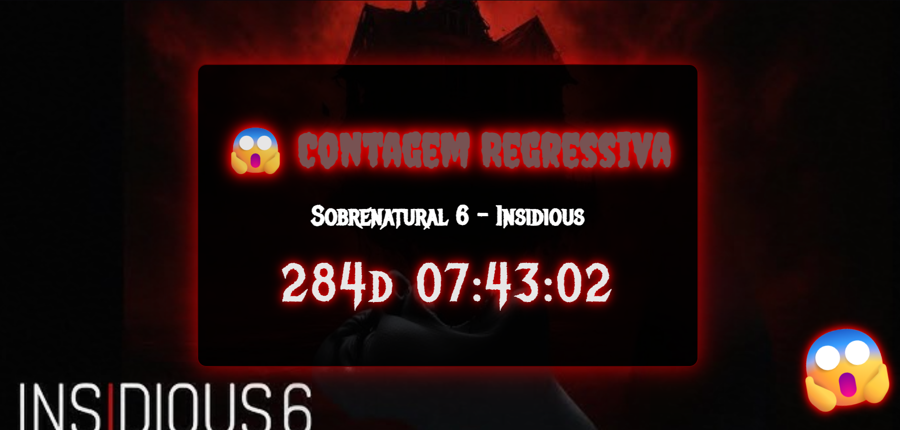

<h1 align="center"> Projeto  Sobrenatural 6  </h1>

Projeto desenvolvido por William Ramos  

  <a href="#-tecnologias">Tecnologias</a>&nbsp;&nbsp;&nbsp;|&nbsp;&nbsp;&nbsp;
  <a href="#-projeto">Projeto</a>&nbsp;&nbsp;&nbsp;|&nbsp;&nbsp;&nbsp;
  <a href="#-layout">Layout</a>&nbsp;&nbsp;&nbsp;|&nbsp;&nbsp;&nbsp;
  <a href="#memo-licença">Licença</a>

  

 

  

## 🚀 Tecnologias

Esse projeto foi desenvolvido com as seguintes tecnologias:

[x] HTML, CSS e JS

[x] Git e Github

## 💻 Projeto

Projeto sobre o filme Sobrenatural 6 .

- [Acesse o projeto finalizado, online](https://github.com/williamsramos/insidious6)
- [Acesse o site do projeto finalizado, online](https://williamsramos.github.io/insidious6)
- [Acesse o site do projeto finalizado, online](https://insidious6.vercel.app)
- [Acesse o site do projeto finalizado, online](https://insidious6.netlify.app)

## :memo: Licença

Esse projeto está sob a licença MIT.

---

Feito após curso da  ♥ by William Ramos :wave:

‣慰楮潣㜭